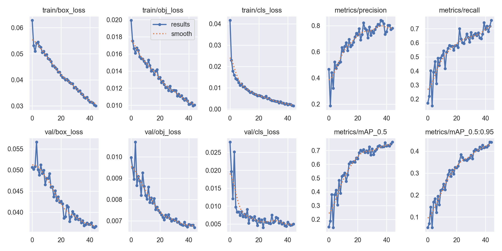
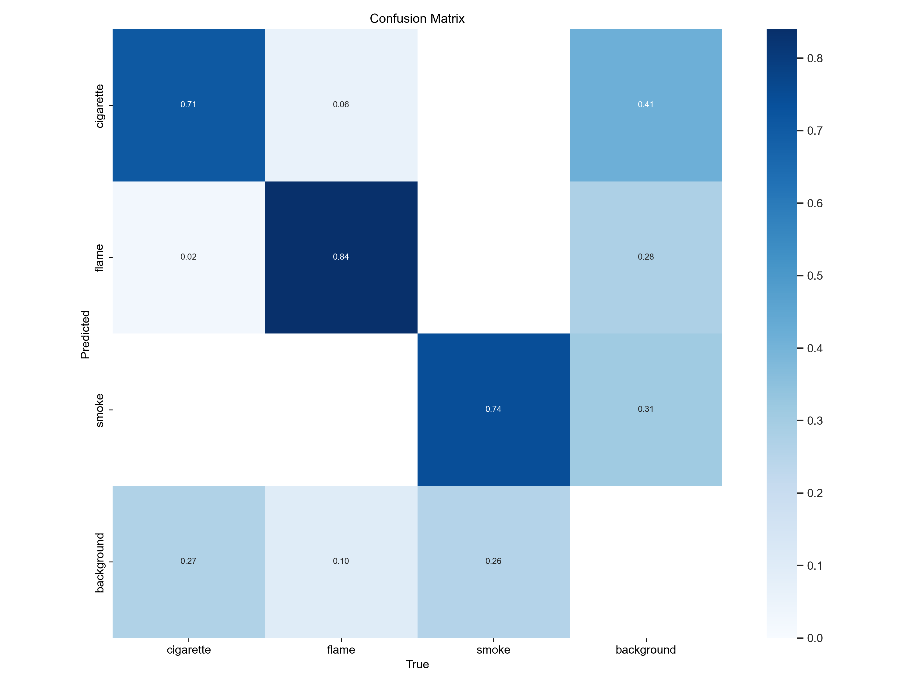

# 45-epoch clean-split experiment

Experiment date: 2026-08-11

This is the first complete local retraining run after repairing cross-split leakage and correcting the clean dataset class definition to `cigarette`, `flame`, and `smoke`.

## Dataset and configuration

| Item | Value |
| --- | --- |
| Train / validation / test images | 1,511 / 188 / 188 |
| Test instances | 171 |
| Cross-split source, SHA-256, and perceptual-hash overlaps | 0 |
| Architecture | YOLOv5s, 7,018,216 fused parameters |
| Initialization | `models/legacy/best.pt` |
| Epochs | 45 |
| Image size | 640 x 640 |
| Batch size | 8 |
| Device | Apple MPS |
| Workers / seed | 2 / 0 |

The legacy checkpoint names class 1 `face-cigarette-smoking`, while the clean dataset defines class 1 as `flame`. Its baseline is retained to measure the behavior of the previously supplied model, but it is not a semantically aligned flame detector.

## Independent test results

Both checkpoints were evaluated with the same script, 188-image test split, 640 px input, batch size 8, and MPS device.

| Model | Precision | Recall | mAP@0.5 | mAP@0.5:0.95 |
| --- | ---: | ---: | ---: | ---: |
| Legacy baseline | 0.461 | 0.105 | 0.084 | 0.033 |
| Retrained `best.pt` | **0.841** | **0.680** | **0.755** | **0.453** |
| Absolute improvement | +0.380 | +0.575 | +0.671 | +0.421 |

### Retrained model by class

| Class | Instances | Precision | Recall | mAP@0.5 | mAP@0.5:0.95 |
| --- | ---: | ---: | ---: | ---: | ---: |
| cigarette | 82 | 0.794 | 0.634 | 0.717 | 0.404 |
| flame | 50 | 0.812 | 0.740 | 0.763 | 0.360 |
| smoke | 39 | 0.919 | 0.667 | 0.786 | 0.595 |

Test evaluation took 24.23 seconds. Mean model inference time was 11.3 ms per image at batch size 8. The single-image smoke-test example detected one `flame` at 0.31 confidence in 18.9 ms; the legacy checkpoint produced no detection on the same image.

## Validation and training behavior

The final validation of the selected checkpoint reported Precision 0.782, Recall 0.759, mAP@0.5 0.761, and mAP@0.5:0.95 0.442. Training and validation losses declined throughout the run, while recall and both mAP metrics continued to improve through the final epochs.





## Resource usage

- Total wall-clock training time across the interrupted and resumed segments: approximately 2 hours 4 minutes.
- Maximum resident set size reported by macOS: approximately 2.82 GB.
- Peak memory-footprint field, including the MPS/unified-memory workload: approximately 13.1 GB.
- Swap operations: 0.
- Final `best.pt` size: approximately 14 MB.
- Published experiment artifacts: approximately 39 MB.

## Published artifacts

- [`runs/full_clean_45e/`](runs/full_clean_45e/): full training configuration, CSV history, console log, curves, batches, and `best.pt`/`last.pt`.
- [`runs/baseline_clean_test/`](runs/baseline_clean_test/): legacy checkpoint evaluation plots and prediction batches.
- [`runs/full_clean_test/`](runs/full_clean_test/): independent test curves, confusion matrix, labels, and predictions.
- [`runs/full_clean_inference/`](runs/full_clean_inference/): representative single-image inference output.

## Reproduction

```bash
cd training/leakage_safe_yolov5
./setup_environment.sh
source .venv/bin/activate
python scripts/verify_dataset.py dataset
./train_clean.sh --epochs 45 --img 640 --batch 8 --device mps --workers 2 --name full_clean_45e
WEIGHTS="$PWD/runs/full_clean_45e/weights/best.pt" ./evaluate_clean.sh --device mps --batch-size 8 --workers 2 --name full_clean_test
```
